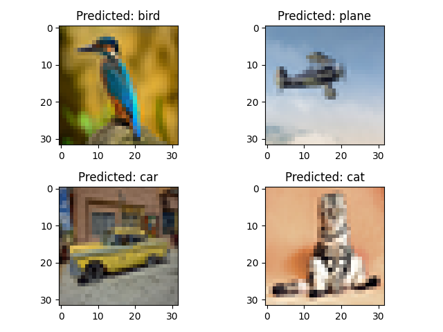
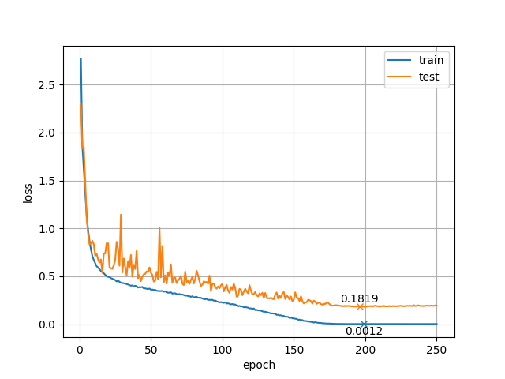
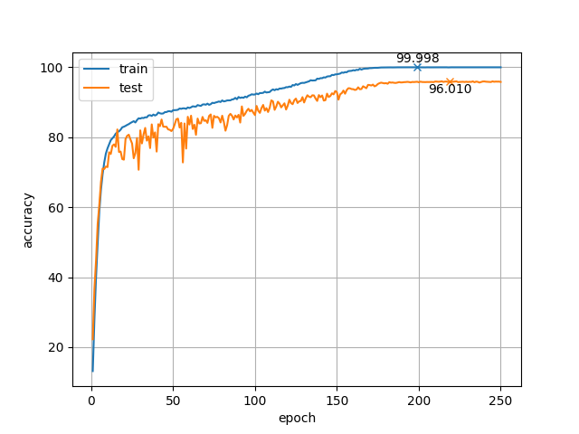

# ResNet for CIFAR-10

[CIFAR-10](https://www.cs.toronto.edu/~kriz/cifar.html) データセット用に [ResNet](https://arxiv.org/pdf/1512.03385.pdf) を実装し，**`96.01 %`** の認識精度を達成しました．



## 実装したもの
ResNet101 と ResNet152 を実装しました．(と言っても二つはほぼ同じですが…)<br>
このうち精度が高かった `ResNet101` の方を採用しました．<br>
また，論文に載っている ResNet では初めのボトルネックブロックの前に Max Pooling の層があるのですが，これは**ない方が精度が良かった**ように思います．<br>
また，Post Activation よりも Pre Activation の方が精度が良いと言う記事もありましたが，今回は `Post Activation` の方が精度が良くなりました．<br>
層の構造については `torchsummary` を使って表示したものを [result ディレクトリ](result) にあげています．([ResNet101](result/resnet101-summary.txt), [ResNet152](result/resnet152-summary.txt))<br>
この結果に出力される層の順番は毎回少しずつ異なるようなので(?)，**順番が違っていても層が同じなら**同じモデルになっていると思います．

## パラメータ
学習率は 0.1 に設定しました．<br>
学習は SGD (勾配降下法) + Momentum (0.9) で，weight_decay は 5e-4 に設定しました．<br>
スケジューラには　CosineAnnealingLR を使用しています．<br>
エポックは 250 回しましたが，200 前後で大体サチルと思います．<br>
250エポック回すには NVIDIA Quadro RTX 8000 で 5 時間ぐらいかかりました．<br>
学習の様子は下に載せているので，参考にしてください．

## 使い方
1. ダウンロード・インストール
```bash
$ git clone https://github.com/hashi0203/ResNet.git
$ cd ResNet
$ pip3 install -r requirements.txt
```
Cuda 10.0 もしくは 10.1 なら問題なく動くと思いますが，それ以外のバージョンの場合は適宜 Pytorch のバージョンなどを変更してください．

2. 学習
```bash
$ python3 -u main.py
```
オプション
- `--lr`: 学習率 (デフォルトは 0.1)
- `--resume`, `-r`: checkpoint を指定して再開する (指定しなければ一から学習を始める)
- `--summary`, `-s`: torchsummary を標準出力に表示する

その他のパラメータ等は main.py をいじって変更してください．

3. 学習経過の可視
```bash
$ python3 visualizer.py
```
オプション
- `--file`: 可視化したいログファイル (複数も可能) を指定する (指定されていなければ `log` ディレクトリの中身を全て可視化する)

4. 推論
```bash
$ python3 infer.py /path/to/checkpoint
```
`/path/to/checkpoint` には推論に使いたい checkpoint を指定してください．

オプション
- `--image`: 推論したい画像 (複数も可能) を指定する (指定されていなければ `image` ディレクトリの中身を全て推論する)

画像のリサイズなどは自動で行うので，推論したい画像をそのまま入れてください．

## ディレクトリの中身
- `data`: 画像データがダウンロードされる．
- `log`: 学習途中の loss や accuracy の情報が保存される．
- `checkpoint`: テストの正解率が最大の checkpoint が保存される．
- `graph`: 学習時の loss や accuracy を可視化したグラフが保存される．
- `image`: 推論をする画像を入れておく．
- `answer`: 推論した結果が保存される．
- `result`: 作成者が実行した際のログなどを保存している．

`log`, `checkpoint`, `graph` に保存されるファイル名には学習を開始した時間 (月日-時分) の 4+1+4 桁が付加されています．<br>
`answer` に保存されるファイル名にも同様に推論を開始した時間が付加されます．

## 結果
学習時の loss や accuracy の変化は以下の図のようになりました．

 

200 エポックあたりでサチっていて 150 エポックぐらいでも十分な精度が得られていると思います．

推論の結果は以下のようになりました．<br>
全て正しく予測されています．


## 参考文献
https://arxiv.org/pdf/1512.03385.pdf
https://github.com/kuangliu/pytorch-cifar
https://www.bigdata-navi.com/aidrops/2611/
https://deepage.net/deep_learning/2016/11/30/resnet.html